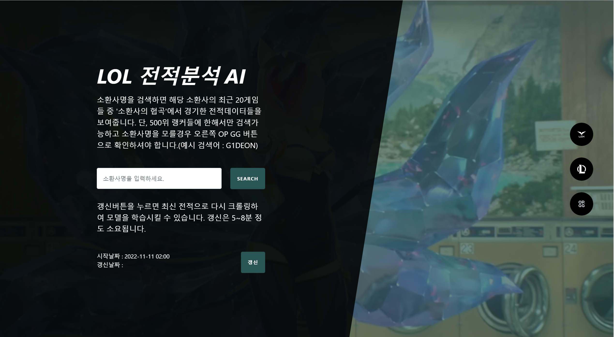
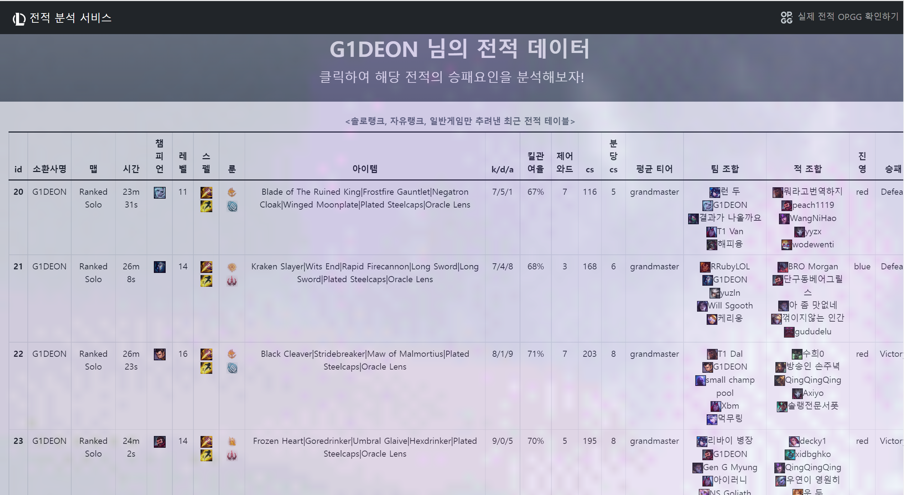
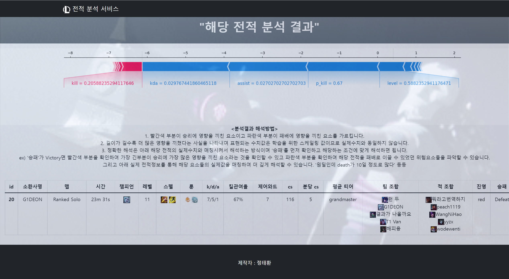
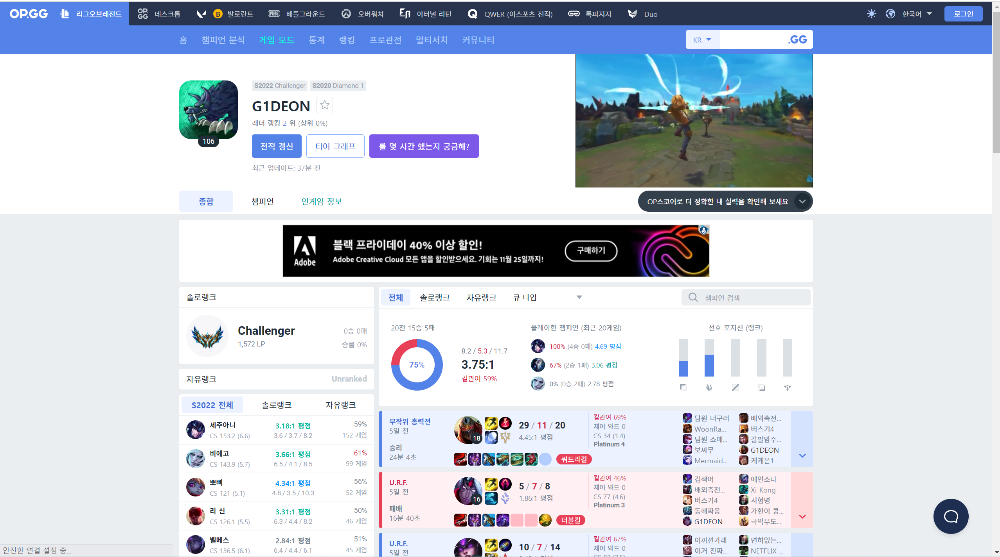
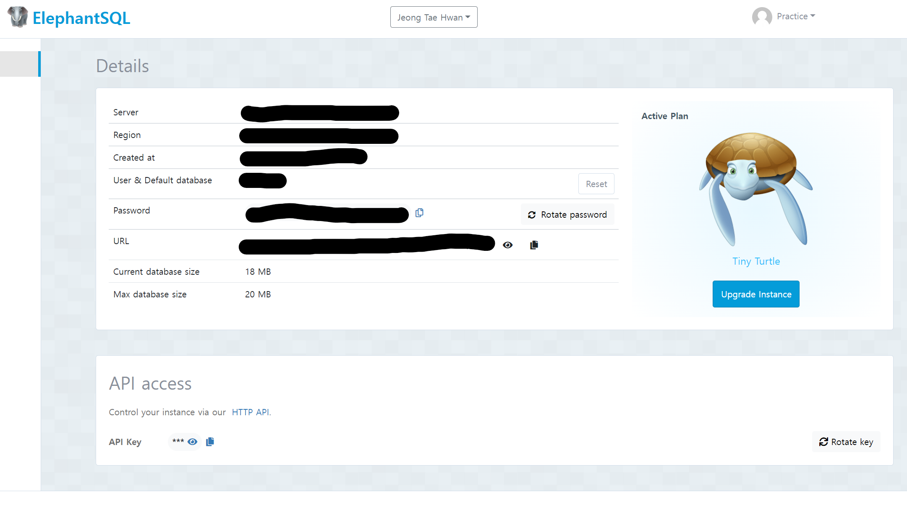
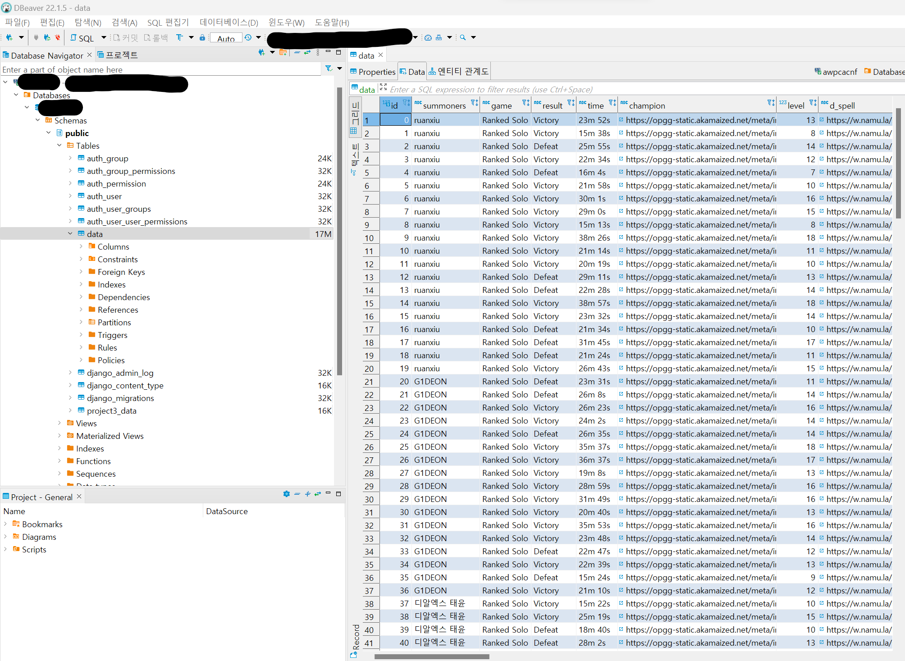
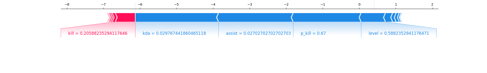
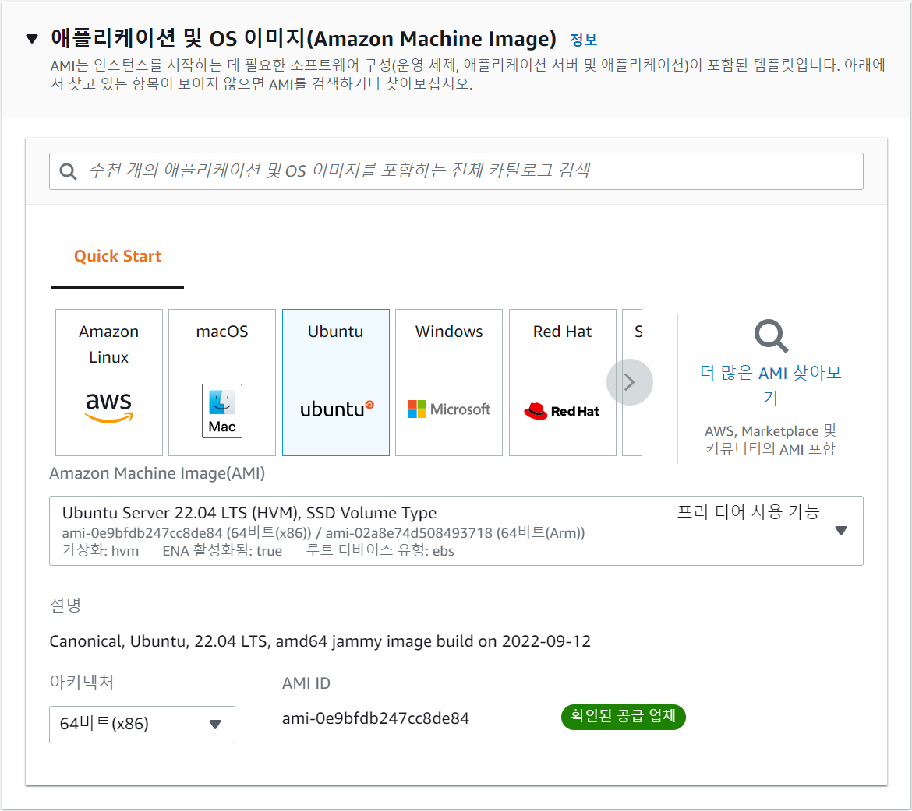
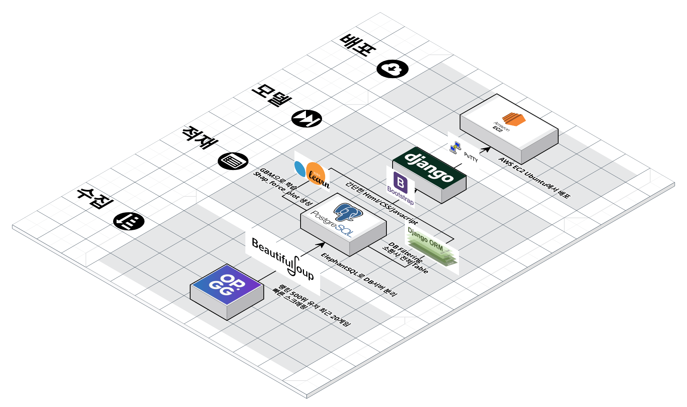

# **League of Legends 승패요인 분석 서비스(LOL AI코칭)**
League of Legends 상위 500위에 속하는 랭커들의 최근 20게임 데이터들을 머신러닝으로 학습시키고 XAI 지표인 shap_plot을 활용하여 어떤 인게임 요소들이 승패에 얼마만큼 영향을 끼쳤는지 보여주는 서비스  
<br/>

## **개요**
### **진행기간**
원본 : 2022년 4월  
수정 : 2022년 11월  
수정사항 : Flask, Heroku -> Django, AWS  
<br/>

동일한 주제로 프로젝트 수행경험이 있습니다. 당시에는 Flask로 Back-end를 구성했기에 따로 공부하고 있는 Django를 통해 새롭게 구현해보기로 했습니다. 그리고 Heroku에서 올해 11월 말까지만 프리티어 무료배포를 지원한다는 소식으로 인해 AWS EC2로 배포방식을 수정하게 되었습니다.  
<br/>

### **사용스킬 요약** 
- 주요 언어 : Python 3.9
- Editor : VS Code
- Scraping : BeautifulSoup4
- Proprocessing : Pandas, Sklearn
- DB : ElephantSQL
- Back-end : Django
- Front-end : Bootstrap참고-HTML, CSS, Javascript
- AI Modeling : Sklearn
- Distribution : AWS EC2 Ubuntu  
<br/>

### **목차** 
1. 서비스 소개
2. 개발 과정
3. 서비스 시연
4. 개선사항  
<br/>

## **서비스 소개**
### **1. 배경**
기존 OP GG 전적 검색 사이트는 어떤 요소들이 얼마만큼 승패에 작용했는지 알려주는 코칭 서비스를 제공해주지 않습니다. 매 경기 코칭 서비스를 제공해주려면 전문가가 해당 게임의 플레이를 처음부터 끝까지 분석해주어야 정확한 분석이 가능하기에 시간과 비용 측면에서 무리라고 판단하는 것 같습니다.  
하지만 머신러닝을 도입하여 가볍게 즐길 정도만이라도 제공해줄 수 있다면 유저들은 마치 프로처럼 자신의 플레이를 분석하며 사이트 이용에 색다른 재미를 느끼게 될 것입니다. 이는 유저들의 사이트 이용목적 다양화를 통해 게임 플레이만 하고 전적 사이트를 이용하지 않던 유저들을 유인하는 효과로도 이어질 수 있습니다.  
매 경기 인게임 데이터들를 머신러닝으로 학습시키고 승패에 영향을 끼친 긍정적, 부정적 요소들을 SHAP를 통해 보여줄 수 있다면 유사 코칭 서비스를 구현해 낼 수 있습니다.  
<br/>

### **2. 서비스 FLOW**
1. 검색창에서 유저아이디로 유저검색  
   <p align="center"></p><br/>
2. 갱신전 시간 기준 해당 유저의 최근 20게임 전적데이터 확인  
   <p align="center"></p><br/>
3. 전적 클릭시 해당하는 게임의 승패에 어떤 인게임 요소들이 얼마나 영향을 끼쳤는지 shap_force_plot으로 보여주기  
   <p align="center"></p>
<br/>

> ### SHAP란?
> **SHAP(SHapley Additive exPlanations)**는 **Shapley Value(Game Theory를 바탕으로 협력 Game에서 각 Player의 기여분을 수치화한 값)**를 기반으로 예측값에 대하여 각 피쳐가 미치는 기여도를 측정하여 글로벌 변수 중요도 뿐만 아니라 개별 예측값에 대한 각 변수들의 영향력을 해석할 수 있는 XAI지표입니다. 그래서 force_plot을 통해 개별 예측값에 대한 긍정적, 부정적 요인 해석을 게임 승패예측값에 대한 긍정적, 부정적 요인 분석으로 연결해서 생각할 수 있습니다.
<br/>

## **개발 과정**
### **1. 데이터 수집**
1. LOL OP GG사이트에서 랭킹 500위 유저들의 최근 20게임 전적 데이터들을 BeautifulSoup4로 스크래핑합니다.  
<p align="center"></p><br/>

> **랭커 데이터를 수집하는 이유?**  
> 롤에서 메타에 가장 민감하게 반응하는 구간이자 포지션에 따른 인게임 지표가 가장 두드러지게 나타나는 구간이 바로 랭커구간입니다. 예를 들면 원딜 포지션의 랭커들은 분당 CS, KDA가 다른 포지션의 플레이어들보다 높을 수 밖에 없습니다. 그리고 이러한 미션을 해당 게임내에서 잘 수행해냈다면 승리에 큰 영향을 끼쳤다고 해석할 수 있습니다. 특히 고티어 유저들은 포지션별로 이러한 특징이 가장 잘 나타납니다. 포지션별 역할이 정형화되어있기에 해석에 있어서 적합한 데이터는 랭커들의 데이터라고 할 수 있습니다.

> **BeautifulSoup4로 스크랩핑한 이유?**  
> Riot api를 통해 받아올 수도 있지만 굳이 크롤링을 선택한 이유는 Riot api의 requests 제한이  
> 20 requests every 1 seconds(s)  
> 100 requests every 2 minutes(s)  
> 
> 위와 같이 걸려있기 때문입니다. 또한 필요로 하는 매치데이터를 받아오기 위해서는 소환사명 api를 받아오고 다시 소환사별로 매치데이터를 따로 요청해야합니다. 한 소환사의 매치데이터를 받아오는데도 44번정도의 api요청이 발생하는데 10000개의 매치데이터를 받아오려면 상당히 많은 시간이 소요될 것을 예상할 수 있습니다. 실제로 인터넷에서 Riot api를 다루는 글들을 찾아보면 받아오는 속도도 느리고 받고 나서도 유효한 데이터를 추출해내는 과정이 필요해서 이미 Riot api를 잘 가공해놓은 OP GG를 크롤링하는 것이 속도면에서 훨씬 효율적이라는 사실을 알 수 있습니다. 갱신 서비스도 함께 만들 것이기 때문에 시간소요를 최대한 줄이기위해 스크래핑을 선택하게 되었습니다.  
> 
> 또한 Selenium 동적 웹크롤러가 필요하지 않은 이유는 OP GG에서는 소환사 기본페이지에 최근 20게임의 매치데이터들을 다 보여주고 있는데 html을 한번만 스크래핑하면 필요한 데이터들을 다 긁어올 수 있기 때문입니다. 즉, 버튼 클릭 등 동적으로 생성된 html을 긁어올 필요가 없습니다.

<br/>

1. crawling.py 파일을 만들어 실행하고 csv파일로 수집결과를 저장합니다. 이때 7000개 정도 수집되는 시점에 OP GG에서 block을 거는데 4분이라는 시간을 기다렸다가 다시 수집하도록 5000개에서 time.sleep을 줍니다. (**AWS EC2 t2.micro의 코어가 1이기 때문에 multiprocessing을 통한 병렬처리는 하지 못했습니다. 다만 Asyncio와 같은 비동기 호출방식으로 속도를 개선시킬 수 있을 것 같습니다.**)  
   ```python
   # 자세한 내용은 project3/crawling.py 파일을 보시면 알 수 있습니다.
   def concat_data():
      ranker = top_500_list() # 500위 랭커 리스트 구하기
      df1 = make_data(ranker[:250]) # 1~250위까지 20게임씩 스크래핑
      time.sleep(180) # 3분 딜레이
      df2 = make_data(ranker[250:]) # 251~500위까지 20게임씩 스크래핑
      df = pd.concat([df1, df2], ignore_index=True)
      df.to_csv('data.csv', index=False) # csv파일로 저장
      
      return df
   ```
<br/>

2. 수집된 데이터를 EDA하고 몇몇 row들은 drop해줍니다. 예를 들어 게임승패가 '다시하기'인 경우 한명이 탈주함으로 인해 정상적인 게임이 아니므로 드랍해줍니다. 자세한 내용은 project3/ai.py 파일의 row_drop() 함수를 보시면 알 수 있습니다.  
<br/>

### **2. 데이터 적재**
머신러닝 모델에 학습시키기 전 소환사의 전적을 보여주는 서비스를 먼저 구현해야하므로 DB에 데이터들을 저장시켜줄 필요가 있습니다. 특별히 챔피언, 룬, 스펠, 아이템 등은 이미지로 표현해주는게 훨씬 좋기 때문에 가능하다면 각 요소들의 값을 이미지링크로 대체시켜줄 필요도 있습니다. 굳이 이미지 링크인 이유는 github의 100MB 제한뿐만 아니라 DB에 적재시킬 때 문자열 형식으로 저장하게 되면 훨씬 간편하게 대량의 이미지들을 서비스에 보여줄 수 있기 때문입니다.  
<br/>

1. ElephantSQL을 통해 PostgreSQL DB서버를 따로 분리해서 호스팅해줍니다.
<p align="center"></p><br/>

2. 챔피언, 룬, 스펠 데이터들을 이미지링크로 바꿔서 csv파일로 저장해주고 이를 DB에 적재시킵니다. 자세한 내용은 db.py, project3/remake_data.py 파일을 보시면 알 수 있습니다.  
<p align="center"></p><br/>

### **3. 머신러닝 모델 학습**
1. 학습에 용이하게 데이터를 다시 전처리하고 모델은 GradientBoostingClassifier, 하이퍼파라미터 튜닝은 RandomizedSearchCV로 간단하게 학습시킵니다. 최적의 모델을 pickle파일로 저장해줍니다. 자세한 내용은 project3/ai.py 파일을 보시면 알 수 있습니다.
   ```python
   def boosting(pro_x, y):
      # 학습 및 하이퍼 파라미터 튜닝
      gbm = GradientBoostingClassifier(random_state=42)

      params = {
         "learning_rate" : [0.05, 0.1, 0.15, 0.2, 0.25, 0.3, 0.35, 0.4, 0.45, 0.5],
         "n_estimators" : [100, 500]
      }

      model = RandomizedSearchCV(gbm, param_distributions=params, n_iter=5, scoring='accuracy', n_jobs=-1, cv=3, verbose=1, random_state=42)
      model.fit(pro_x, y)

      print('최적 하이퍼파라미터 :', model.best_params_)
      print('최적 정확도 :', model.best_score_)
      # 최적 하이퍼파라미터 : {'n_estimators': 500, 'learning_rate': 0.05}
      # 최적 정확도 : 0.9089591690046142

      # 피클 파일로 저장
      with open("model.pickle", "wb") as fw:
         pickle.dump(model.best_estimators, fw)
      return model
   ```
<br/>

2. 특정 소환사명이 들어오면 이를 인덱스로 받아들이고 이 인덱스에 해당하는 shap_force_plot 이미지를 생성해줍니다.
   ```python
   def shap_plot(model, pro_df, index):
      row = pro_df.iloc[index,:]
      explainer = shap.TreeExplainer(model)
      shap_values = explainer.shap_values(row)

      shap.force_plot(
         base_value=explainer.expected_value, 
         shap_values=shap_values,
         features=row,
         show=False,
         matplotlib = True
      ).savefig('project3/static/image/shap.png')
      return explainer, shap_values
   ```
<p align="center"></p><br/>

### **4. Django로 Back-end 구성**
MVT 패턴에 맞게 project3라는 앱을 만든 후 PostgreSQL을 model과 연결해주고 Bootstrap CSS, Javascript를 베이스로 적절한 수정을 거쳐 만들어진 templates들을 views로 렌더링해줍니다. 자세한 내용은 ds_project3_new/settings.py, project3/models.py, project3/urls.py, project3/views.py, project3/templates 파일들, project3/static 파일들을 보시면 알 수 있습니다.
1. models.py  
이미 DB서버에 table이 존재하므로 "python manage.py inspectdb > models.py"로 models.py 파일을 생성할 수 있습니다. 여기서는 직접 만들어 보았습니다.
   ```python
   from django.db import models

   # PostgreSQL DB와 연동될 장고 Model
   class data(models.Model):
      id = models.BigIntegerField(primary_key=True)
      summoners = models.CharField(max_length=255)
      game = models.CharField(max_length=255)
      result = models.CharField(max_length=255)
      time = models.CharField(max_length=255)
      champion = models.TextField()
      level = models.IntegerField()
      d_spell = models.TextField()
      f_spell = models.TextField()
      main_rune = models.TextField()
      sub_rune = models.TextField()
      items = models.TextField()
      kill = models.IntegerField()
      death = models.IntegerField()
      assist = models.IntegerField()
      p_kill = models.CharField(max_length=255)
      pinkward = models.IntegerField()
      cs = models.IntegerField()
      cs_per_min = models.IntegerField()
      average_tier = models.CharField(max_length=255)
      team_champs = models.TextField()
      team = models.TextField()
      enemy_champs = models.TextField()
      enemy = models.TextField()
      side = models.CharField(max_length=255)

      class Meta:
         db_table = 'data'
   ```
<br/>

2. urls.py
   ```python
   from django.urls import path
   from . import views

   urlpatterns = [
      path('', views.index, name='index'),
      path('table/', views.index2, name='index2'),
      path('<int:id>/', views.index3, name='index3')
   ]
   ```
<br/>

3. views.py
   ```python
   # 첫 화면 출력.
   def index(request):
      # 갱신요청을 post로 받음
      if request.method=="POST":
         # 데이터 새롭게 크롤링
         concat_data()
         row_drop()

         # 새로운 모델 생성
         pro_x, y, pro_df = preprocess()
         model = boosting(pro_x, y)

         # postgres db갱신
         remake_data()
         remake_db()

         # 갱신날짜 표시
         date = datetime.datetime.now()
         context = {"date" : data}
         return render(request, 'index.html', context)

      return render(request, 'index.html')

   # 소환사 명을 받아서 db에서 필터링한 결과를 보내줌.
   def index2(request):
      name = request.GET['summoners']
      dat = data.objects.filter(summoners=name)
      context = {"data" : dat, "name" : name}
      return render(request, 'index2.html', context)

   # 두번째화면에서 클릭한 row에 해당하는 index값의 shap_plot을 생성하고 이를 출력.
   def index3(request, id):
      with open('project3/model.pickle', 'rb') as fr:
         model = pickle.load(fr)
      pro_x, y, pro_df = preprocess()
      shap_plot(model, pro_df, id)
      dat = data.objects.get(id=id)
      context = {"data" : dat}
      return render(request, 'index3.html', context)
   ```
<br/>

### **5. 배포**
AWS EC2 Ubuntu를 이용해 클라우드 상에서 배포하였습니다.
<p align="center"></p><br/>
로컬OS가 윈도우11이라서 putty를 통해 원격접속한 점을 빼고는 아래의 블로그를 따라하면서 배포시켰습니다.   

<a href="https://nerogarret.tistory.com/45?category=800142" target="_blank" rel="noreferror">네로의 다락방 - Django 서비스 AWS로 배포하기</a>
<br/><br/>

### **6. 최종 데이터 파이프라인**
<br/>
<p align="center"></p><br/>

## **서비스 시연**
현재는 비용으로 인해 인스턴스를 종료했습니다.  
~~도메인명과 https 설정은 하지 않았습니다.~~  
~~URL : ec2-13-124-110-212.ap-northeast-2.compute.amazonaws.com~~  
<a href="http://ec2-13-124-110-212.ap-northeast-2.compute.amazonaws.com" target="_blank" rel="noreferror">~~바로가기~~</a>
<br/>

## **아쉬운 점**
- **갱신속도** : 전적데이터의 경우, 매일매일 새롭게 갱신되는 데이터이므로 서비스로 제공하려면 갱신속도가 매우 빨라야합니다. 하지만 크롤링과정에서 5분 정도의 많은 시간소요가 발생하고 DB 업데이트 과정 역시도 1분 이상의 시간소요가 발생하면서 전체적으로 갱신속도가 7분이 넘어갑니다. api를 이용해 갱신속도를 줄이는 방법을 고민해봐야겠습니다.
- **아이템 속성** : 아이템의 경우, 이미지링크가 아닌 문자열로만 표현했습니다. 시간을 더 투자해서 아이템도 이미지링크로 바꿔 적재할 필요가 있습니다.
- **보안** : https 설정을 하지 않아서 보안문제가 우려됩니다. 지출을 해서라도 보안을 지킬 필요가 있습니다.
- **서비스의 질** : 정확성을 고려하지 않은 단순한 부스팅 모델과 빈약한 html태그들로 인해 UI와 신뢰성이 좋지않습니다.  

결국, XAI를 활용해서 어떻게 서비스로 보여줄 수 있는지를 시도한 기본적인 프로젝트입니다. 좀 더 발전시키기 위해서는 버전업 방식으로 갱신되는 전적 데이터를 모델에 매번 재학습시키고 학습데이터의 양을 더 늘려 딥러닝과 같은 고성능 모델을 활용해 모델 정확도를 높이는 식으로 가면 될 것 같습니다. 또한 프론트엔드와 백엔드적 역량까지 된다면 더 예쁘고 안전하면서 효율적인 서비스를 만들 수 있을 것입니다.